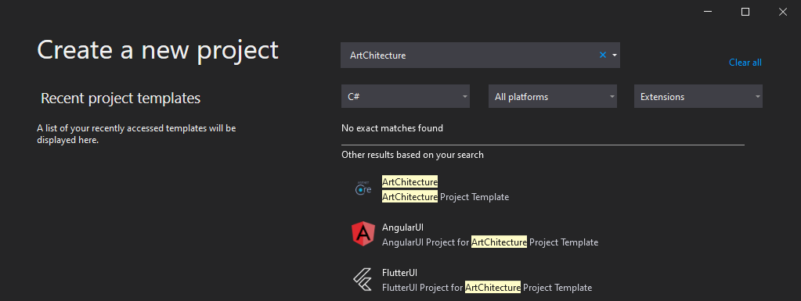
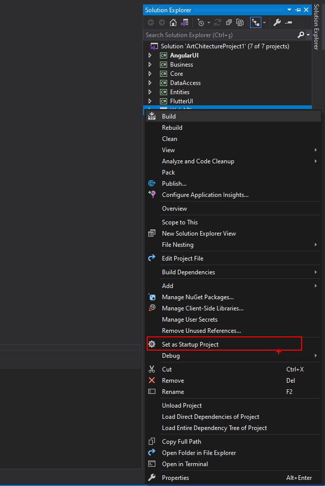
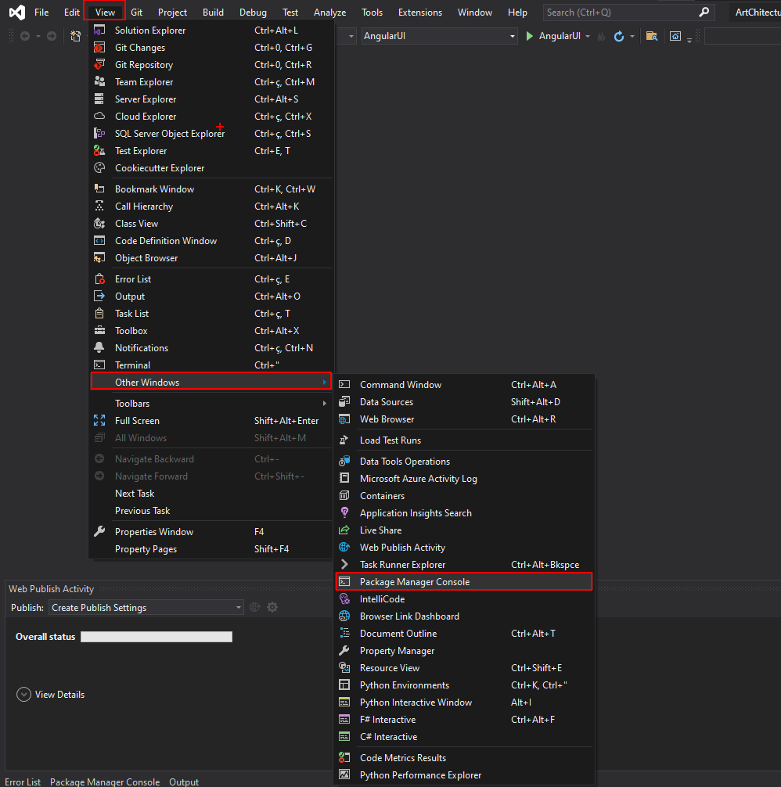
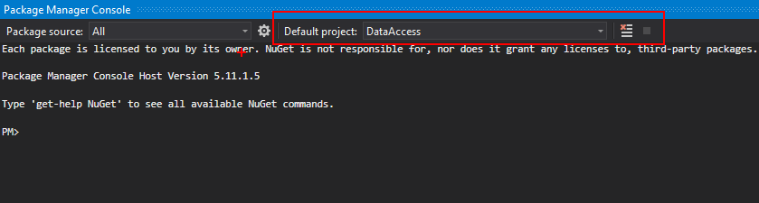
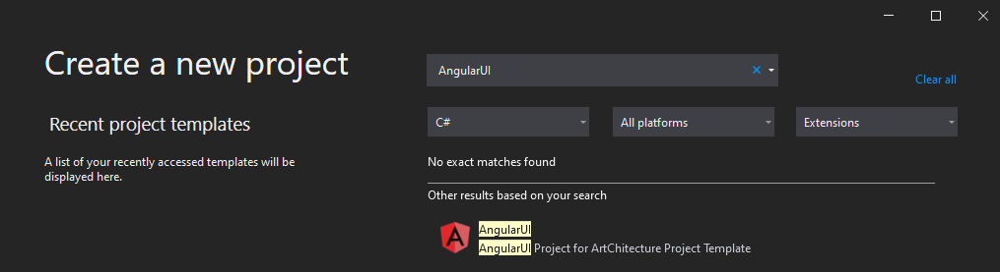
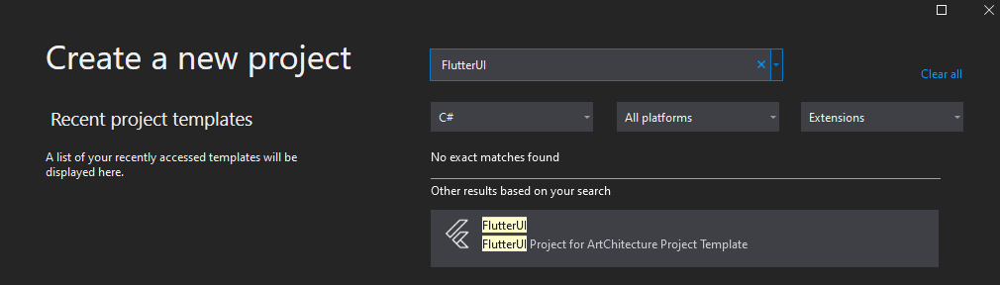

# Başlamadan Önce

> Başlamadan önce yapılması gereken bazı konfigürasyonları yapılandıralım.

---

## Platformlar
- ### ArtChitecture
    > ArtChitecture proje şablonunu kullanmak için herhangi bir platforma bağımlı değilsiniz.
    > 
    > .Net 5 derleyebilecek herhangi bir geliştirme ortamını kullanabilirsiniz.
    > 
    > ---
    >
    > Önerilen platformlar
    >> - Visual Studio 2019
    >> - Jetbrains Rider
    >> - Visual Studio Code
    >
    > ArtChitecture kurulumları Visual Studio 2019 için gösterilecektir.


- ### ArtChitecture.Angular
    > ArtChitecture.Angular proje şablonunu kullanmak için herhangi bir platforma bağımlı değilsiniz.
    > 
    > ---
    >
    > Önerilen platformlar
    >> - Visual Studio Code
    >
    > ArtChitecture.Angular kurulumları Visual Studio 2019 ve Visual Studio Code için gösterilecektir.

- ### ArtChitecture.Flutter
    > ArtChitecture.Flutter proje şablonunu kullanmak için herhangi bir platforma bağımlı değilsiniz.
    > 
    > ---
    >
    > Önerilen platformlar
    >> - Visual Studio Code
    >> - Android Studio
    >
    > ArtChitecture.Flutter kurulumları Visual Studio 2019 ve Android Studio için gösterilecektir.

## Kurulumlar
- ### ArtChitecture

    ---

    - #### ArtChitecture'u Edinin
    > Visual Studio 2019 geliştirme ortamını kullanıyorsanız
    > 
    > [Visual Studio 2019 için ArtChitecture'u Edinin (Ücretsiz)](https://marketplace.visualstudio.com/items?itemName=ismailkaygisiz.ArtChitectureAPI)

    > Visual Studio 2019 dışında bir geliştirme ortamı kullanıyorsanız
    >
    > [ArtChitecture'u Edinin (Ücretsiz)](https://github.com/ismailkaygisiz/ArtChitecture)

    - #### Proje Oluşturma
    > Eklenti kurulumu yapıldıktan sonra Visual Studio çalıştırılır ve proje oluşturma ekranında ArtChitecture seçilir.

    
    
    > Proje oluşturulduktan sonra bir süre beklemeniz gerekiyor bağımlılıkların sağlıklı bir şekilde çözümlenmesi için.
    > 
    > Daha sonra `WebAPI` içinde bulunan `appsettings.json` dosyası içinde konfigürasyonları kendi projenize uygun olacak şekilde yapınız.
    >
    > Bu işlemden sonra `WebAPI` projesi başlangıç projesi olarak işaretlenmelidir. Bunun için `WebAPI` projesine sağ tıklayıp başlangıç projesi olarak ayarla seçeneğini işaretlemelisiniz.

    
    
    - #### Veritabanı Yapılandırma
    > ArtChitecture default olarak bir veritabanı yapılandırmasıyla gelmektedir. 
    > Bu yapıyla beraber önce veritabanı oluşacaktır. 
    > Daha sonra Türkçe, İngilizce dil desteği bu dillere ait çeviriler, Admin ve User kullanıcı rolleri oluşacaktır.
    >
    > NOT: Bu yapı sadece `Microsoft SQL Server` için test edilmiştir !
    > 
    > `Visual Studio 2019` üzerinde `Package Manager Console` çalıştırılır. Daha sonra default project olarak `DataAccess` seçilir 
    >
    > NOT: Bu esnada `Başlangıç Projesinin` `WebAPI` olduğundan emin olun 
    
    

    
    > 
    ```
    Update-Database -context ProjectDbContext
    ```
    > Komutu `Package Manager Console` üzerinde çalıştırılır.
    >
    > Komutu çalıştırdıktan sonra hata almadıysanız veritabanınızın başarıyla oluşmuş olması gerekmektedir.

    - #### Projeyi Çalıştırma
    > Tüm işlemleri başarıyla tamamladıktan sonra projenin sağlıklı şekilde kurulduğunu test etmek amacıyla proje çalıştırılır.
    > 
    > Proje hata vermeden çalıştıysa önünüze `Swagger` sayfası gelmelidir. Test etmek amacıyla `api/languages/getall` adresine istek atalım.
    > 
    > Eğer diller başarıyla geldiyse projenizi başarıyla kurdunuz demektir. 
    >
    > Diğer aşamalara geçebilirsiniz.

- ### ArtChitecture.Angular

    ---

    - #### ArtChitecture.Angular'ı Edinin
    > Visual Studio 2019 geliştirme ortamını kullanıyorsanız (Geliştirme için Visual Studio Code kullanılacaktır kurulum için Visual Studio 2019 Kullanılacaktır.)
    > 
    > [Visual Studio 2019 için ArtChitecture.Angular'ı Edinin (Ücretsiz)](https://marketplace.visualstudio.com/items?itemName=ismailkaygisiz.ArtChitecture)

    > Visual Studio 2019 dışında bir geliştirme ortamı kullanıyorsanız
    >
    > [ArtChitecture.Angular'ı Edinin (Ücretsiz)](https://github.com/ismailkaygisiz/ArtChitecture)

    - #### Proje Oluşturma
    > Eklenti kurulumu yapıldıktan sonra Visual Studio çalıştırılır ve proje oluşturma ekranında AngularUI seçilir (ArtChitecture.AngularUI).

    

    > NOT: Bu aşamada öncesinde `ArtChitecture` projesi oluşturduysanız proje çözümü(solution) üzerinde sağ tıklayıp yeni proje olarak da ekleyebilirsiniz.
    > 
    > Eğer visual studio kullanarak kurulumu yaptıysanız başlangıç projesi olarak AngularUI seçip projeyi çalıştırın. 
    >
    > NOT: Bu işlem sonucunda eğer `angular/cli@12.0.3` yüklü değilse otomatik yüklenecektir
    >
    > Sürümün değişmesini istemiyorsanız AngularUI projesi içinde bulunan Program.cs dosyası içinde düzenleyebilirsiniz `(düşük sürümler önerilmez)`
    >
    > Bu işlem tamamlandıktan sonra AngularUI projesi içinde angular-ui klasörü oluşacaktır bu klasörü istediğiniz geliştirme ortamı ile açabilirsiniz.
    >
    > `src/api.ts` dosyasının içindeki alanları kendi API'nize göre düzenleyin.

- ### ArtChitecture.Flutter
   
    ---

    - #### ArtChitecture.Flutter'ı Edinin
    > Visual Studio 2019 geliştirme ortamını kullanıyorsanız (Geliştirme için Android Studio kullanılacaktır kurulum için Visual Studio 2019 Kullanılacaktır.)
    > 
    > [Visual Studio 2019 için ArtChitecture.Flutter'ı Edinin (Ücretsiz)](https://marketplace.visualstudio.com/items?itemName=ismailkaygisiz.ArtChitectureFlutter)

    > Visual Studio 2019 dışında bir geliştirme ortamı kullanıyorsanız
    >
    > [ArtChitecture.Flutter'ı Edinin (Ücretsiz)](https://github.com/ismailkaygisiz/ArtChitecture)

    - #### Proje Oluşturma
    > Eklenti kurulumu yapıldıktan sonra Visual Studio çalıştırılır ve proje oluşturma ekranında FlutterUI seçilir (ArtChitecture.FlutterUI).

    

    > NOT: Bu aşamada öncesinde `ArtChitecture` projesi oluşturduysanız proje çözümü(solution) üzerinde sağ tıklayıp yeni proje olarak da ekleyebilirsiniz.
    > 
    > Eğer visual studio kullanarak kurulumu yaptıysanız başlangıç projesi olarak FlutterUI seçip projeyi çalıştırın. 
    >
    > Bu işlem tamamlandıktan sonra FlutterUI projesi içinde flutter-ui klasörünü istediğiniz geliştirme ortamı ile açabilirsiniz.
    >
    > `lib/environments/api.dart` dosyasını kendi API'nize göre düzenleyin.
    > Eğer hata alıyorsanız konsol üzerinde 
    ```
    flutter pub get
    ```
    > Komutunu çalıştırın