# Başlayalım

> Bu tutorial `2.4` sürümü için hazırlanmıştır.
---

## ArtChitecture

### Entity Oluşturma
> Entity nesneleri için bizim veritabanında tutacağımız modellerin C# için hazırlanmış karşılıkları diyebiliriz.
> Bu sayede veritabanında tuttuğumuz bir tabloyu sadece tek bir entity için modelleyip zahmetsiz kullanabiliriz.
> İlk entity nesnemizi oluşturalım
> Solution içinde bulunan `Entities` projesinin içindeki `Concrete` klasörüne sağ tıklayıp `Add->New Item` seçeneğini seçelim.
> Açılan sekmede `class` seçip nesnemize `Animal` ismini verip `Add` butonuna basalım
> 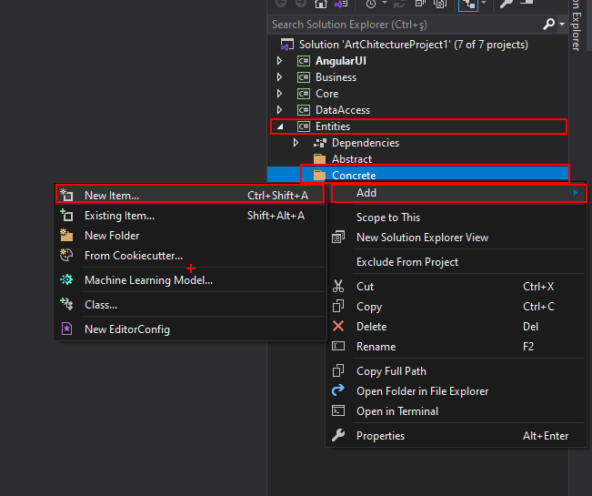 
>
> Açılan sayfaya aşağıdaki kod bloğunu ekleyin
> ```cs
> using Core.Entities.Abstract;
>
> namespace Entities.Concrete
> {
>    public class Animal : IEntity
>    {
>        public int Id { get; set; }
>        public string Name { get; set; }
>        public string OwnerName { get; set; }
>    }
> }
> ```
> Tebrikler ilk Entity sınıfınızı oluşturdunuz. 

---

### Entity için Veritabanı Modellemesi
> Şimdi oluşturduğumuz `Animal` nesnesi için veritabanı konfigürasyonlarını yapalım.
> 
> İlk önce `DataAccess` projesi içinde bulunan `ProjectDbContext.cs` dosyasını açalım
> 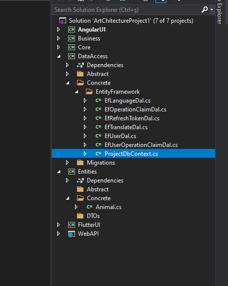
>
> Dosyanın içine aşağıdaki kod bloğunu resimdeki gibi ekleyelim.
> ```cs 
> public DbSet<Animal> Animals { get; set; }
> ```
> 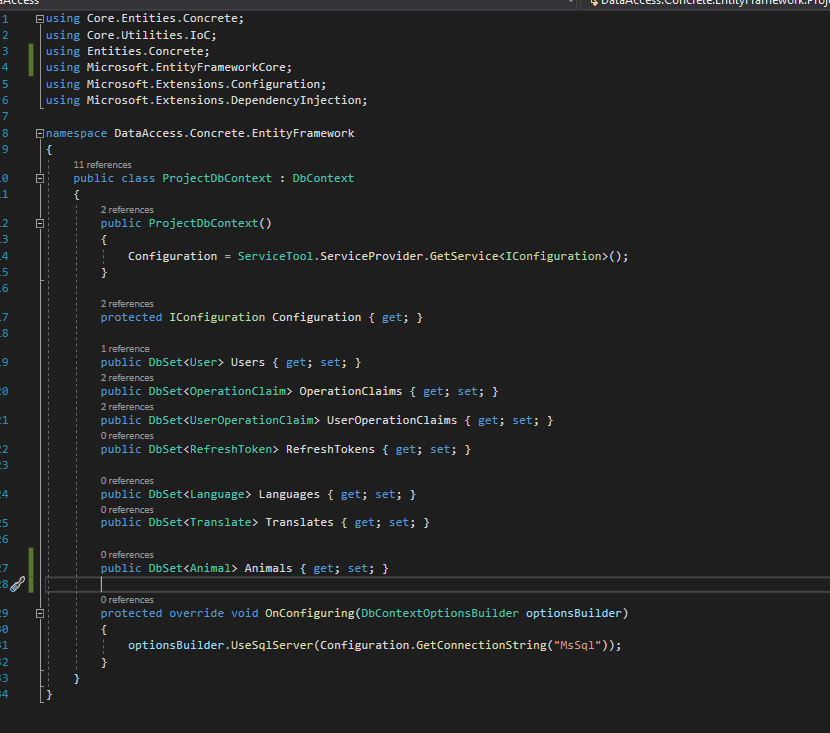
>
> Şimdi veritabanı tablomuzu oluşturalım
> 
> Bu aşamada karşımıza iki kavram çıkıyor
> - Code First
> - Db First
> 
> Hangisini seçeceğiniz size kalmış. Fakat `ArtChitecture` için tavsiye edilen yöntem `DB First` yöntemidir.

- #### Code First Yöntemi
    > Veritabanı tablosunu kod ile eklediğimiz yöntemdir.
    >
    > `Code First` yöntemini yapabilmek için `DbSet` yöntemi kullanarak `ProjectDbContext.cs` dosyasına Entity modelinizi eklemiş olmanız gerekmektedir.
    > 
    > `Package Manager Console` açılır Default Project `DataAccess` seçilir.
    > 
    > `NOT` Başlangıç projenizin `WebAPI` olması gerekmektedir.
    > ```
    > add-migration Animal -Context ProjectDbContext -StartupProject WebAPI -Project DataAccess
    > ```
    > Yukarıdaki kodu `Package Manager Console` üzerinde çalıştırınız.
    > 
    > Migration oluştuktan sonra önünüze ilgili migration sınıfı gelecektir.
    > 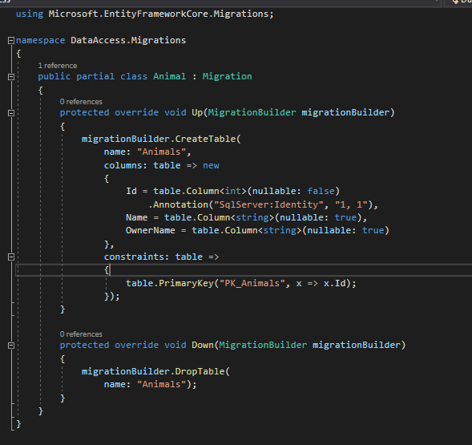
    > 
    > `NOT` Bu sınıfı kontrol etmeden veritabanını güncellemeyin !
    > 
    > Eğer herhangi bir hata almadıysanız ve migration istediğiniz gibi oluştuysa
    > ```
    > Update-Database -Context ProjectDbContext -StartupProject WebAPI -Project DataAccess
    > ```
    > Yukarıdaki kodu tekrar `Package Manager Console` üzerinde çalıştırınız.
    >
    > Hata almadıysanız tablonuzun başarıyla oluşmuş olması gerekmektedir.
    >
    >`NOT` Bu yöntem sadece `Microsoft SQL Server` için test edilmiştir. Diğer veritabanlarında hata alabilirsiniz.

- #### Db First Yöntemi
    > Veritabanı tablosunu el ile eklediğimiz yöntemdir.
    >
    > Bu yöntemde veritabanı tablosunu kendiniz bir script yardımıyla veya başka bir araç yardımıyla oluşturabilirsiniz.
    >
    > `Code First` yöntemine göre daha sağlıklıdır.
    >
    > `ArtChitecture` için tavsiye edilen yöntemdir.

---

### DAL (Data Access Layer Object) Oluşturma
> `Dal` nesneleri bizim veritabanı işlemlerini tek bir merkezden yönetmemizi sağlayan nesnelerdir.
> 
> Bir `Dal` nesnesi oluşturalım 
>
> `Dal` nesnesi için solution içinde bulunan `DataAccess` projesi içindeki `Abstract` klasörüne sağ tıklayıp `Add->New Item` seçeneğini seçelim 
> Açılan ekranda `interface` seçip isim olarak `IAnimalDal` verip `Add` butonuna basalım.
> 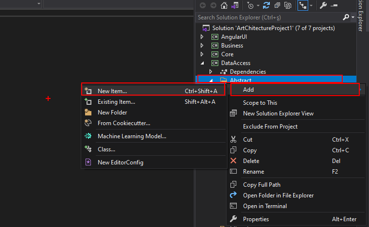
> 
> Daha sonra açılan dosyaya aşağıdaki kod bloğunu ekleyelim
> ```cs
> using Core.DataAccess;
> using Entities.Concrete;
>
> namespace DataAccess.Abstract
> {
>    public interface IAnimalDal : IEntityRepository<Animal>
>    {
>    }
> }
> ```
> Bu işlemden sonra solution içinde bulunan `DataAccess` projesi içindeki `Concrete/EntityFramework` klasörüne sağ tıklayıp `Add->New Item` seçeneğini seçelim 
> Açılan ekranda `class` seçip isim olarak `EfAnimalDal` verip `Add` butonuna basalım.
> 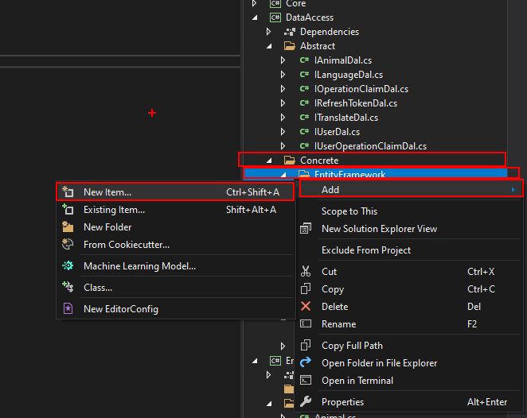
> 
> Daha sonra açılan dosyaya aşağıdaki kod bloğunu ekleyelim
> ```cs
> using Core.DataAccess.EntityFramework;
> using DataAccess.Abstract;
> using Entities.Concrete;
>
> namespace DataAccess.Concrete.EntityFramework
> {
>    public class EfAnimalDal : EfEntityRepositoryBase<Animal, ProjectDbContext>, IAnimalDal
>    {
>    }
> }
> ```
> Tebrikler `Animal` nesnesi için bir `Dal` nesnesi oluşturdunuz. 

---

### Service Oluşturma
> `Service`, `Dal` ve `Controller` arasında bulunarak denetim yapmamızı sağlayan nesnelerdir.
> `Sevice` nesneleri sayesinde gelen verinin kontrolünü sağlayabilir ve buna göre işlem yapabiliriz.
> Bir `Service` nesnesi oluşturalım
> `Service` nesnesi için solution içinde bulunan `Business` projesi içindeki `Abstract` klasörüne sağ tıklayıp `Add->New Item` seçeneğini seçelim 
> Açılan ekranda `interface` seçip isim olarak `IAnimalService` verip `Add` butonuna basalım.
> 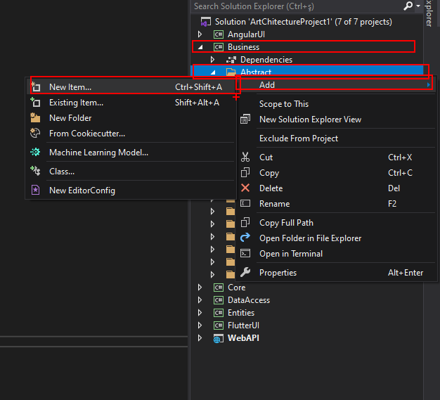
>
> Daha sonra açılan dosyaya aşağıdaki kod bloğunu ekleyelim
> ```cs
> using Core.Business;
> using Entities.Concrete;
>
> namespace Business.Abstract
> {
>    public interface IAnimalService : IServiceRepository<Animal, int>
>    {
>    }
> }
> ```
> Bu işlemden sonra solution içinde bulunan `Business` projesi içindeki `Concrete` klasörüne sağ tıklayıp `Add->New Item` seçeneğini seçelim 
> Açılan ekranda `class` seçip isim olarak `AnimalManager` verip `Add` butonuna basalım.
> 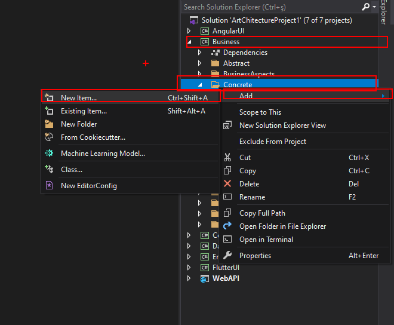
> 
> Daha sonra açılan dosyaya aşağıdaki kod bloğunu ekleyelim
> ```cs
> using Business.Abstract;
>
> namespace Business.Concrete
> {
>    public class AnimalManager : BusinessService, IAnimalService
>    {
>    }
> }
> ```
> Bu kodu ekledikten sonra bir hata ile karşılaşacaksınız.
> Hatayı çözmek için `IAnimalService` `interface'ini` implemente etmeniz gerekmektedir.
> Implemente etmek için hata veren yere mouse imlecini getirip `Ctrl + .` tuş kombinasyonunu uygulayıp Implement interface seçeneğini seçmelisiniz. 
> Eğer `Ctrl + .` sizin için çalışmadıysa yanda çıkan ampul ile de aynı işlemi gerçekleştirebilirsiniz.
> 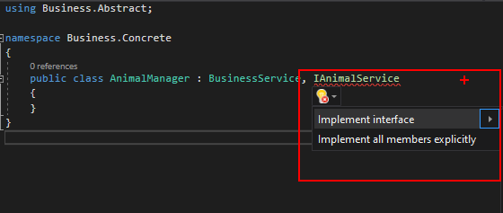
>
> Bütün işlemleri gerçekleştirdikten sonra dosyanın son hali aşağıdaki gibi olmalıdır.
> ```cs
> using Business.Abstract;
> using Core.Utilities.Results.Abstract;
> using Entities.Concrete;
> using System.Collections.Generic;
> 
> namespace Business.Concrete
> {
>    public class AnimalManager : BusinessService, IAnimalService
>    {
>        public IResult Add(Animal entity)
>        {
>            throw new System.NotImplementedException();
>        }
>
>        public IResult Delete(Animal entity)
>        {
>            throw new System.NotImplementedException();
>        }
>
>        public IDataResult<List<Animal>> GetAll()
>        {
>            throw new System.NotImplementedException();
>        }
>
>        public IDataResult<Animal> GetById(int id)
>        {
>            throw new System.NotImplementedException();
>        }
>
>        public IResult Update(Animal entity)
>        {
>            throw new System.NotImplementedException();
>        }
>    }
> }
> ```
>
> Tebrikler `Animal` nesnesi için bir `Service` nesnesi oluşturdunuz. 

### Dal ve Service'i Birlikte Kullanma
> `Service` nesnelerinin içinde `Dal` nesnesi kullanmak için `Dependency Injection` yöntemini kullanırız.
> Yapıcı methoda parametre olarak verilen nesne için gerekli referans `IoC Container` tarafından otomatik olarak atanır.
> Bu sayede bir sınıfın örneğine başka projelerden de erişebiliriz. 
>
> Örnek kullanım aşağıdaki gibidir.
> ```cs
> private readonly IAnimalDal _animalDal;
>
> public AnimalManager(IAnimalDal animalDal)
> {
>    _animalDal = animalDal;
> }
> ```
> `NOT` Kod bloğunu ekledikten sonra gerekli importları yapmanız gerekmektedir.
> 
> Bu kod bloğunu da ekledikten sonra sınıfın son hali aşağıdaki gibi olmalıdır.
>
> ```cs
> public class AnimalManager : BusinessService, IAnimalService
> {
>   private readonly IAnimalDal _animalDal;
>
>   public AnimalManager(IAnimalDal animalDal)
>   {
>       _animalDal = animalDal;
>   }
>
>   public IResult Add(Animal entity)
>   {
>       throw new System.NotImplementedException();
>   }
>
>   public IResult Delete(Animal entity)
>   {
>       throw new System.NotImplementedException();
>   }
>
>   public IDataResult<List<Animal>> GetAll()
>   {
>       throw new System.NotImplementedException();
>   }
>
>   public IDataResult<Animal> GetById(int id)
>   {
>       throw new System.NotImplementedException();
>   }
>
>   public IResult Update(Animal entity)
>   {
>        throw new System.NotImplementedException();
>   }
> }
> ```
> Bu adımı da tamamladıktan sonra artık oluşturduğumuz `Dal` sınıfını kullanabiliriz.
> 
> `Dal` nesnesini kullanmadan önce tam olarak ne yaptığını iyice anlamamız gerekiyor.
> 
> `Dal` nesnesi, veritabanı işlemlerindeki uğraşı minimum düzeye indirmek için kullandığımız bir yardımcıdır.
> Bu sayede her nesne ve tablo için ekstra kod yazmadan veritabanı işlemlerini halledebiliriz.
> 
> `Add` - `Delete` - `Update` - `Get` - `GetAll` metotlarına gömülü olarak sahiptir.
>
> `Add` metodu sayesinde ilgili nesneyi tabloya ekleriz.
> 
> `Delete` metodu sayesinde ilgili nesneyi tablodan sileriz.
> 
> `Update` metodu sayesinde tablodaki ilgili nesneyi güncelleriz.
>
> `Get` metodu sayesinde tablodan parametre olarak girilen koşulu sağlayan nesneyi alabiliriz. (Tekil nesneler için kullanılır) 
> 
> `GetAll` metodu sayesinde tablodan parametre olarak girilen koşulu sağlayan nesneleri alabiliriz. (Çoğul nesneler için kullanılır)
>
> `GetAll` için parametre değeri verilmezse bütün tabloyu almamızı sağlar.
> 
> Eğer istersek `Dal` nesneleri için özel metotlar oluşturup kullanımı pratikleştirebiliriz.
> 
> `Dal` nesnesinin neden kullanıldığını artık anladığımıza göre şimdi kullanımını görelim.
> 
> ```cs
> public IResult Add(Animal entity)
> {
>   _animalDal.Add(entity);
>   return new SuccessResult("Animal Added");
> }
> 
> public IResult Delete(Animal entity)
> {
>   _animalDal.Delete(entity);
>   return new SuccessResult("Animal Deleted");
> }
> 
> public IResult Update(Animal entity)
> {
>   _animalDal.Update(entity);
>   return new SuccessResult("Animal Updated");
> }
> 
> public IDataResult<Animal> GetById(int id)
> {
>   return new SuccessDataResult<Animal>(_animalDal.Get(animal => animal.Id == id));
> }
> 
> public IDataResult<List<Animal>> GetAll()
> {
>   return new SuccessDataResult<List<Animal>>(_animalDal.GetAll());
> }
> ```
>
> Bütün işlemleri gerçekleştirdikten sonra sınıfın en son hali aşağıdaki gibi olmalıdır.
> ```cs
> public class AnimalManager : BusinessService, IAnimalService
> {
>    private readonly IAnimalDal _animalDal;
>
>    public AnimalManager(IAnimalDal animalDal)
>    {
>        _animalDal = animalDal;
>    }
> 
>    public IResult Add(Animal entity)
>    {
>        _animalDal.Add(entity);
>        return new SuccessResult("Animal Added");
>    }
>
>    public IResult Delete(Animal entity)
>    {
>        _animalDal.Delete(entity);
>        return new SuccessResult("Animal Deleted");
>    }
>
>    public IDataResult<List<Animal>> GetAll()
>    {
>        return new SuccessDataResult<List<Animal>>(_animalDal.GetAll());
>    }
>
>    public IDataResult<Animal> GetById(int id)
>    {
>        return new SuccessDataResult<Animal>(_animalDal.Get(animal => animal.Id == id));
>    }
>
>    public IResult Update(Animal entity)
>    {
>        _animalDal.Update(entity);
>        return new SuccessResult("Animal Updated");
>    }
> }
> ```
> 
> Artık `Dal` ve `Service` nesnelerini birlikte kullanabiliriz.

### Service Özelleştirme
> Service özelleştirme işlemini `Service` nesnelerine harici metot eklemek
> olarak tanımlayabiliriz.
>
> `Service` nesnesine yeni bir metot eklemek aslında çok kolaydır.
>
> Aşağıda bulunan kod bloğunu `IAnimalService` içine ekliyoruz.
> ```cs
> IDataResult<List<Animal>> GetByAnimalName(string animalName);
> ```
> 
> Kod bloğunu ekledikten sonra son hali aşağıdaki gibi olmalıdır.
>
> ```cs
> using Core.Business;
> using Core.Utilities.Results.Abstract;
> using Entities.Concrete;
> using System.Collections.Generic;
>
> namespace Business.Abstract
> {
>    public interface IAnimalService : IServiceRepository<Animal, int>
>    {
>        IDataResult<List<Animal>> GetByAnimalName(string animalName);
>    }
> }
> ```
> Daha sonra metodu `AnimalManager` içinde `implement` ediyoruz.
> Aksi takdirde program hata verir.
> 
> Aşağıda nasıl implement yapılacağı gösterilmektedir.
> 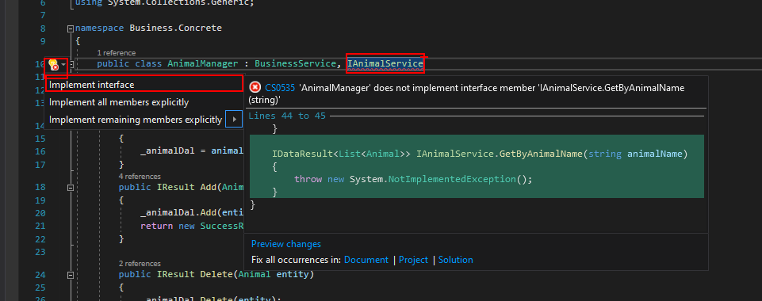
> 
> Metodu implement ettikten sonra metodun içini silip aşağıdaki kod 
> bloğunu ekliyoruz.
> ```cs
> 
> return new SuccessDataResult<List<Animal>>(_animalDal.GetAll(animal => animal.Name == animalName));
> ``` 
>
> Bu işlemden sonra dosyanın son hali aşağıdaki gibi olmalıdır.
> ```cs
> using Business.Abstract;
> using Core.Utilities.Results.Abstract;
> using Core.Utilities.Results.Concrete;
> using DataAccess.Abstract;
> using Entities.Concrete;
> using System.Collections.Generic;
>
> namespace Business.Concrete
> {
>    public class AnimalManager : BusinessService, IAnimalService
>    {
>        private readonly IAnimalDal _animalDal;
>
>        public AnimalManager(IAnimalDal animalDal)
>        {
>            _animalDal = animalDal;
>        }
>        public IResult Add(Animal entity)
>        {
>            _animalDal.Add(entity);
>            return new SuccessResult("Animal Added");
>        }
>
>        public IResult Delete(Animal entity)
>        {
>            _animalDal.Delete(entity);
>            return new SuccessResult("Animal Deleted");
>        }
>
>        public IDataResult<List<Animal>> GetAll()
>        {
>            return new SuccessDataResult<List<Animal>>(_animalDal.GetAll());
>        }
>
>        public IDataResult<List<Animal>> GetByAnimalName(string animalName)
>        {
>            return new SuccessDataResult<List<Animal>>(_animalDal.GetAll(animal => animal.Name == animalName));
>        }
>
>        public IDataResult<Animal> GetById(int id)
>        {
>            return new SuccessDataResult<Animal>(_animalDal.Get(animal => animal.Id == id));
>        }
>
>        public IResult Update(Animal entity)
>        {
>            _animalDal.Update(entity);
>            return new SuccessResult("Animal Deleted");
>        }
>    }
> }
> ```
> Artık özelleştirilmiş bir `Service` nesneniz var.
---

### Controller Oluşturma
> `Controller` Client ile Service arasındaki iletişimi sağlayan nesne olarak tanımlanabilir.
>
> Bu proje bir API projesi olduğu için clientlar http isteğinde bulunduğu zaman `Controller` ile etkileşime geçmektedir. `Controller` dosyaları mümkün olduğunca temiz bırakılmalıdır, gereksiz kod yazılmamalıdır.
> 
> Bir `Controller` nesnesi oluşturalım. `Controller` nesnesi içi solution içinde bulunan `WebAPI` projesi içindeki `Controllers` klasörüne sağ tıklayıp `Add->Class` seçeneğini seçelim. Açılan sekmede isim olarak `AnimalsController` verip `Add` butonuna basalım. 
>
> 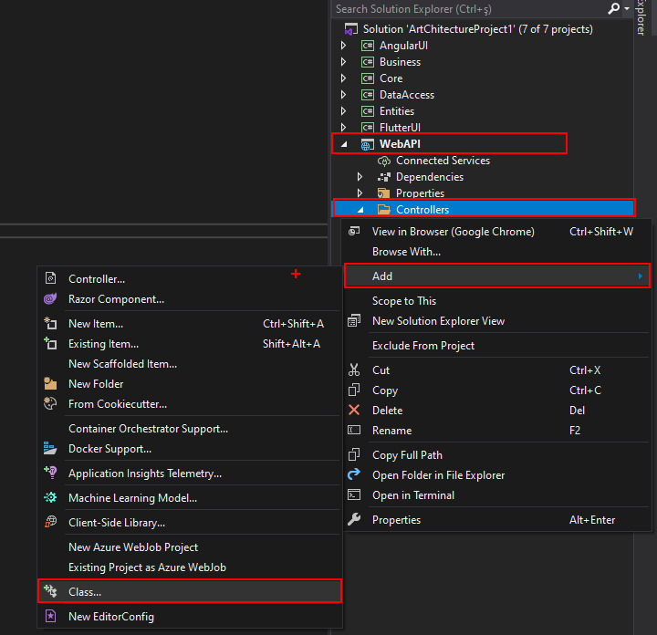
> 
> Daha sonra dosyanın içine aşağıdaki kod bloğunu ekleyelim.
> ```cs
> using Business.Abstract;
> using Entities.Concrete;
> using Microsoft.AspNetCore.Mvc;
> using WebAPI.Controllers;
>
> public class AnimalsController : ControllerRepository<Animal, int>
> {
>    private readonly IAnimalService _animalService;
>
>    public AnimalsController(IAnimalService animalService) : base(animalService)
>    {
>        _animalService = animalService;
>    }
> }
> ```
> `ControllerRepository` bizim için `Add`, `Delete`, `Update`, `GetById`, `GetAll` metotlarını otomatik olarak kaydedecektir. Bu yüzden bunlar için özel metotlar oluşturmamıza gerek yok. 

### Controller Özelleştirme
> `Controller` özelleştirme işlemini `Controller` nesnelerine harici metot eklemek olarak tanımlayabiliriz.
> 
> `Controller` nesnesine yeni bir metot eklemek aslında çok kolaydır.
>
> Aşağıda bulunan kod bloğunu `AnimalsController` içine ekleyelim.
> ```cs
> [HttpGet("[action]")]
> public IActionResult GetByAnimalName(string animalName)
> {
>   var result = _animalService.GetByAnimalName(animalName);
>    if (result.Success) 
>       return Ok(result);
>       
>    return BadRequest(result);
> }
> ```
> Kod bloğunu ekledikten sonra son hali aşağıdaki gibi olmalıdır.
> ```cs
> using Business.Abstract;
> using Entities.Concrete;
> using Microsoft.AspNetCore.Mvc;
> using WebAPI.Controllers;
>
> public class AnimalsController : ControllerRepository<Animal, int>
> {
>    private readonly IAnimalService _animalService;
>
>    public AnimalsController(IAnimalService animalService) : base(animalService)
>   {
>        _animalService = animalService;
>    }
>
>    [HttpGet("[action]")]
>    public IActionResult GetByAnimalName(string animalName)
>    {
>        var result = _animalService.GetByAnimalName(animalName);
>        if (result.Success) 
>            return Ok(result);
>        
>        return BadRequest(result);
>    }
> }
> ```
> 
> Artık özelleştirilmiş bir `Controller` nesneniz var.

### Controller'ı Service Olmadan Kullanma
> Bazen herhangi bir `Service` nesnesine bağlı kalmak istemeyiz böyle durumlarda `Controller` nesnesini bu bölümde anlatıldığı gibi kullanmak daha basit ve mantıklı olur.
>
> Bu nesneler yine `Service` nesneleriyle bağlantıyı sağlayabilir. `AnimalsController` nesnesinden farklı olarak `Add`, `Delete`, `Update`, `GetById`, `GetAll` işlemlerini içermemektedir (Harici olarak ekleyebilirsiniz).
> Daha fazla bilgi almak için `WebAPI->Controllers->AuthController.cs` dosyasını inceleyebilirsiniz.
> ```cs
> using Microsoft.AspNetCore.Mvc;
> using Controller = WebAPI.Controllers.Controller;
>
> namespace WebAPI.Controllers
> {
>    public class ControllerWithoutService : Controller
>    {
>        public ControllerWithoutService()
>        {
>
>        }
>    }
> }
> ```
> `NOT` Bu alanı mevcut projenize eklemenize gerek bulunmamaktadır.
---

### Bağımlılıkları Çözme
> Mevcut durumda projeyi çalıştırıp `Animal` nesnesini etkileyecek herhangi bir istekte bulunduğunuz zaman hata alacaksınız.
> Bu hatayı çözmek için `Business->DependencyResolvers->Autofac` içinde bulunan `AutofacBusinessModule.cs` dosyasını açalım.
> 
> Aşağıda bulunan kod bloğunu `Load` metodunun içine ekleyelim.
> ```cs
> builder.RegisterType<EfAnimalDal>().As<IAnimalDal>().SingleInstance();
> builder.RegisterType<AnimalManager>().As<IAnimalService>().SingleInstance();
> ```
> Bu işlemi yaptıktan sonra dosyanın son hali aşağıdaki gibi olmalıdır.
> ```cs
> using Autofac;
> using Autofac.Extras.DynamicProxy;
> using Business.Abstract;
> using Business.Concrete;
> using Business.Helpers;
> using Castle.DynamicProxy;
> using Core.Entities.Concrete;
> using Core.Utilities.Interceptors;
> using Core.Utilities.Security.JWT;
> using DataAccess.Abstract;
> using DataAccess.Concrete.EntityFramework;
> using System.Reflection;
> using Module = Autofac.Module;
>
> namespace Business.DependencyResolvers.Autofac
> {
>    public class AutofacBusinessModule : Module
>    {
>        protected override void Load(ContainerBuilder builder)
>        {
>            builder.RegisterType<EfAnimalDal>().As<IAnimalDal>().SingleInstance();
>            builder.RegisterType<AnimalManager>().As<IAnimalService>().SingleInstance();
>
>            // DataAccessLayer
>            builder.RegisterType<EfOperationClaimDal>().As<IOperationClaimDal>().SingleInstance();
>            builder.RegisterType<EfUserOperationClaimDal>().As<IUserOperationClaimDal>().SingleInstance();
>            builder.RegisterType<EfUserDal>().As<IUserDal>().SingleInstance();
>            builder.RegisterType<EfLanguageDal>().As<ILanguageDal>().SingleInstance();
>            builder.RegisterType<EfTranslateDal>().As<ITranslateDal>().SingleInstance();
>            builder.RegisterType<EfRefreshTokenDal>().As<IRefreshTokenDal>().SingleInstance();
>
>            // BusinessLayer
>            builder.RegisterType<AuthManager>().As<IAuthService>().SingleInstance();
>            builder.RegisterType<OperationClaimManager>().As<IOperationClaimService>().SingleInstance();
>            builder.RegisterType<UserOperationClaimManager>().As<IUserOperationClaimService>().SingleInstance();
>            builder.RegisterType<UserManager>().As<IUserService>().SingleInstance();
>            builder.RegisterType<LanguageManager>().As<ILanguageService>().SingleInstance();
>            builder.RegisterType<TranslateManager>().As<ITranslateService>().SingleInstance();
>            builder.RegisterType<RefreshTokenManager>().As<IRefreshTokenService>().SingleInstance();
>
>            builder.RegisterType<RefreshTokenHelper>().As<IRefreshTokenHelper>().SingleInstance();
>
>            // CoreLayer
>            builder.RegisterType<JwtHelper>().As<ITokenHelper<User>>().SingleInstance();
>
>            // Interceptors
>            var assembly = Assembly.GetExecutingAssembly();
>            builder.RegisterAssemblyTypes(assembly).AsImplementedInterfaces()
>                .EnableInterfaceInterceptors(new ProxyGenerationOptions
>                {
>                    Selector = new AspectInterceptorSelector()
>                }).SingleInstance();
>        }
>    }
> }
> ```

### İş Kuralları Yazma
> İş kuralları sayesinde nesne üzerinde işlem yapmadan önce gerekli kuralları sağlayıp sağlamadığına bakabilir ve buna göre işlem yapmasını sağlayabiliriz.
>
> `BusinessRules` sınıfı iş kuralı yazmayı kolaylaştırmak için özel olarak oluşturulmuştur.
>
> Aşağıda bulunan kod bloğunu `AnimalManager` içine ekleyelim
> ```cs
> private IResult CheckIfAnimalNameIsAlreadyExistsForOwner(Animal animal)
> {
>    animal = GetByAnimalName(animal.Name).Data.Find(a=>a.OwnerName == animal.OwnerName);
>
>    if(animal != null)
>    {
>        return new ErrorResult("Animal is already exists for owner");
>    }
>
>    return new SuccessResult();
> }
> ```
> Daha sonra `AnimalManager` içinde bulunan `Add` metodunu aşağıdaki gibi düzenleyelim.
> ```cs
> public IResult Add(Animal entity)
> {
>    var result = BusinessRules.Run(CheckIfAnimalNameIsAlreadyExistsForOwner(entity));
>
>    if (!result.Success)
>        return result;
>
>    _animalDal.Add(entity);
>    return new SuccessResult("Animal Added");
> }
> ```
> Bu işlemden sonra dosyanın son hali aşağıdaki gibi olmalıdır.
> ```cs
> using Business.Abstract;
> using Core.Business;
> using Core.Utilities.Results.Abstract;
> using Core.Utilities.Results.Concrete;
> using DataAccess.Abstract;
> using Entities.Concrete;
> using System.Collections.Generic;
> 
> namespace Business.Concrete
> {
>    public class AnimalManager : BusinessService, IAnimalService
>    {
>        private readonly IAnimalDal _animalDal;
>
>        public AnimalManager(IAnimalDal animalDal)
>        {
>            _animalDal = animalDal;
>        }
> 
>        public IResult Add(Animal entity)
>        {
>            var result = BusinessRules.Run(CheckIfAnimalNameIsAlreadyExistsForOwner(entity));
>
>            if (!result.Success)
>                return result;
>
>            _animalDal.Add(entity);
>            return new SuccessResult("Animal Added");
>        }
>
>        public IResult Delete(Animal entity)
>        {
>            _animalDal.Delete(entity);
>            return new SuccessResult("Animal Deleted");
>        }
>
>        public IDataResult<List<Animal>> GetAll()
>        {
>            return new SuccessDataResult<List<Animal>>(_animalDal.GetAll());
>        }
>
>        public IDataResult<List<Animal>> GetByAnimalName(string animalName)
>        {
>            return new SuccessDataResult<List<Animal>>(_animalDal.GetAll(animal => animal.Name == animalName));
>        }
>
>        public IDataResult<Animal> GetById(int id)
>        {
>            return new SuccessDataResult<Animal>(_animalDal.Get(animal => animal.Id == id));
>        }
>
>        public IResult Update(Animal entity)
>        {
>            _animalDal.Update(entity);
>            return new SuccessResult("Animal Deleted");
>        }
>
>        private IResult CheckIfAnimalNameIsAlreadyExistsForOwner(Animal animal)
>        {
>            animal = GetByAnimalName(animal.Name).Data.Find(a=>a.OwnerName == animal.OwnerName);
>
>            if(animal != null)
>            {
>                return new ErrorResult("Animal is already exists for owner");
>            }
>
>            return new SuccessResult();
>        }
>    }
> }
> ```
### Validasyon Yazma
> Validasyonlar sayesinde nesne üzerinde işlem yapmadan önce koyduğumuz şartlara uyup uymadığına bakabiliriz.
>
> `Business->ValidationRules->FluentValidation` klasörüne sağ tıklayıp `Add->New Item` seçeneğini seçip açılan ekranda `AnimalValidator` ismini verip `Add` butonuna basın.
> 
> Daha sonra aşağıdaki kod bloğunu dosyaya ekleyin.
> ```cs
> using Entities.Concrete;
> using FluentValidation;
>
> namespace Business.ValidationRules.FluentValidation
> {
>    public class AnimalValidator : FluentValidator<Animal>
>    {
>        public AnimalValidator()
>        {
>            RuleFor(animal => animal.Name).NotNull().WithMessage("Animal name can not be null");
>            RuleFor(animal => animal.Name).MinimumLength(2);
>        }
>    }
> }
> ```
> `NOT` Daha Fazlası için [Fluent Validation Dökümanını İnceleyebilirsiniz](https://docs.fluentvalidation.net/en/latest/)
>
> Daha sonra `AnimalManager` içinde bulunan `Add` metodunun üzerine aşağıdaki ifadeyi ekleyin.
> ```cs
> [ValidationAspect(typeof(AnimalValidator))]
> ```
> Bu işlemden sonra dosyanın son hali aşağıdaki gibi olmalıdır.
> ```cs
> using Business.Abstract;
> using Business.ValidationRules.FluentValidation;
> using Core.Aspects.Autofac.Validation;
> using Core.Business;
> using Core.Utilities.Results.Abstract;
> using Core.Utilities.Results.Concrete;
> using DataAccess.Abstract;
> using Entities.Concrete;
> using System.Collections.Generic;
> 
> namespace Business.Concrete
> {
>    public class AnimalManager : BusinessService, IAnimalService
>    {
>        private readonly IAnimalDal _animalDal;
>
>        public AnimalManager(IAnimalDal animalDal)
>        {
>            _animalDal = animalDal;
>        }
>
>        [ValidationAspect(typeof(AnimalValidator))]
>        public IResult Add(Animal entity)
>        {
>            var result = BusinessRules.Run(CheckIfAnimalNameIsAlreadyExistsForOwner(entity));
>
>            if (!result.Success)
>                return result;
>
>            _animalDal.Add(entity);
>            return new SuccessResult("Animal Added");
>        }
>
>        public IResult Delete(Animal entity)
>        {
>            _animalDal.Delete(entity);
>            return new SuccessResult("Animal Deleted");
>        }
>
>        public IDataResult<List<Animal>> GetAll()
>        {
>            return new SuccessDataResult<List<Animal>>(_animalDal.GetAll());
>        }
>
>        public IDataResult<List<Animal>> GetByAnimalName(string animalName)
>        {
>            return new SuccessDataResult<List<Animal>>(_animalDal.GetAll(animal => animal.Name == animalName));
>        }
>
>        public IDataResult<Animal> GetById(int id)
>        {
>            return new SuccessDataResult<Animal>(_animalDal.Get(animal => animal.Id == id));
>        }
>
>        public IResult Update(Animal entity)
>        {
>            _animalDal.Update(entity);
>            return new SuccessResult("Animal Deleted");
>        }
>
>        private IResult CheckIfAnimalNameIsAlreadyExistsForOwner(Animal animal)
>        {
>            animal = GetByAnimalName(animal.Name).Data.Find(a=>a.OwnerName == animal.OwnerName);
>
>            if(animal != null)
>            {
>                return new ErrorResult("Animal is already exists for owner");
>            }
>
>            return new SuccessResult();
>        }
>    }
> }
> ```  

---

## ArtChitecture.Angular

### Entity Modelleme
> API tarafında oluşturduğumuz her nesnenin Client tarafında bir karşılığı olması bize geliştirme sürecinde kolaylıklar sağlayacaktır.
>
> İlk önce solution içinde bulunan `AngularUI` projesinin içinde bulunan angular-ui dosyasını `Visual Studio Code` editöründe açıyoruz.
> Angular için gerekli konfigürasyonları kurulum kısmında yapmıştık eğer yapmadıysanız önce konfigürasyonları yapın.
>
> Projeyi `Visual Studio Code` editöründe açtıktan sonra `src->app->models` klasörüne sağ tıklayıp `New File` seçeneğini seçiyoruz ve oluşturacağımız dosyaya `animalModel.ts` ismini veriyoruz.
> 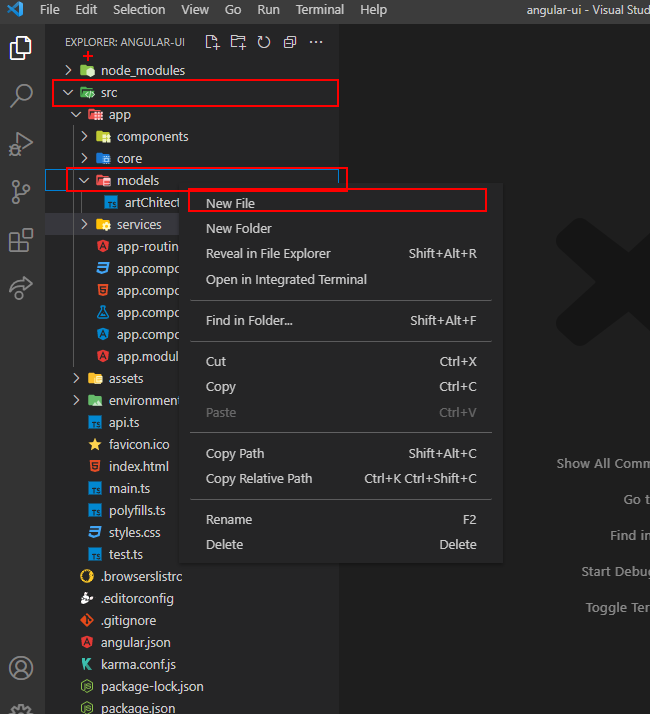
> 
> Daha sonra dosyanın içine aşağıdaki kod bloğunu ekleyip dosyayı kaydediyoruz.
> 
> ```ts
> export interface AnimalModel {
>  id: number;
>  name: string;
>  ownerName: string;
> }
> ```
> Animal nesnesi için artık Angular tarafında bir modelimiz var.
### Service Oluşturma
> API'ye istek atmak için `HttpClient` kullanırız. Fakat istek attığımız kodu her yere yazarsak bu hem karmaşaya sebep olacaktır hem de ileride projede değişikliğe gidildiğinde sıkıntılara sebep olacaktır.
> Bu yüzden istekleri tek bir yerden yöntebilmek için `Service` kullanırız.
>
> `src->app->services` klasörüne sağ tıklayıp `Open in Integrated Terminal` seçeneğini seçelim. Bu işlem bizim için bu dosyayı terminalde açacaktır.
> 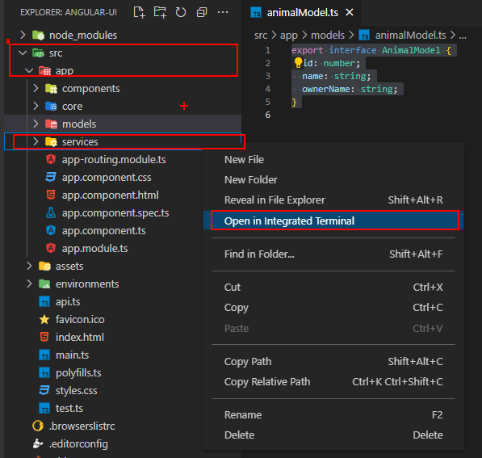
> 
> Açılan terminale aşağıdaki komutu yazalım.
> ```
> ng generate service animal --skip-tests 
> ```
> Bu işlemden sonra eğer hata almazsanız `services` klasörümüzün içine `animal.service.ts` dosyasının oluştuğunu göreceksiniz.
>
> Daha sonra dosyanın içine aşağıdaki kod bloğunu ekleyelim.
> ```ts
> import { HttpClient } from '@angular/common/http';
> import { Injectable } from '@angular/core';
> import { Observable } from 'rxjs';
> import { apiUrl } from 'src/api';
> import { DeleteModel } from '../core/models/deleteModel';
> import { ListResponseModel } from '../core/models/response/listResponseModel';
> import { ResponseModel } from '../core/models/response/responseModel';
> import { SingleResponseModel } from '../core/models/response/singleResponseModel';
> import { ServiceRepository } from '../core/services/service-repository';
> import { AnimalModel } from '../models/animalModel';
> 
> @Injectable({
>  providedIn: 'root',
> })
> export class AnimalService implements ServiceRepository<AnimalModel, number> {
>  constructor(private httpClient: HttpClient) {}
>
>  add(addModel: AnimalModel): Observable<ResponseModel> {
>    throw new Error('Method not implemented.');
>  }
>  delete(deleteModel: DeleteModel): Observable<ResponseModel> {
>    throw new Error('Method not implemented.');
>  }
>  update(updateModel: AnimalModel): Observable<ResponseModel> {
>    throw new Error('Method not implemented.');
>  }
>  getById(id: number): Observable<SingleResponseModel<AnimalModel>> {
>    throw new Error('Method not implemented.');
>  }
>  getAll(): Observable<ListResponseModel<AnimalModel>> {
>    throw new Error('Method not implemented.');
>  }
> }
> ```
> Şimdi metodlarımızın içlerini dolduralım.
> 
> `Add` metodunu aşağıdaki gibi değiştirelim.
> ```ts
> add(addModel: AnimalModel): Observable<ResponseModel> {
>    return this.httpClient.post<ResponseModel>(
>    apiUrl + 'animals/add',
>    addModel
>    );
> }
> ```
> `Delete` metodunu aşağıdaki gibi değiştirelim.
> ```ts
> delete(deleteModel: DeleteModel): Observable<ResponseModel> {
>    return this.httpClient.post<ResponseModel>(
>    apiUrl + 'animals/delete',
>    deleteModel
>    );
> }  
> ```
> `Update` metodunu aşağıdaki gibi değiştirelim.
> ```ts
> update(updateModel: AnimalModel): Observable<ResponseModel> {
>    return this.httpClient.post<ResponseModel>(
>    apiUrl + 'animals/update',
>    updateModel
>    );
> }
> ```
> `GetById` metodunu aşağıdaki gibi değiştirelim.
> ```ts
> getById(id: number): Observable<SingleResponseModel<AnimalModel>> {
>    return this.httpClient.get<SingleResponseModel<AnimalModel>>(
>    apiUrl + 'animals/getbyid?id=' + id
>    );
> }
> ```
> `GetAll` metodunu aşağıdaki gibi değiştirelim.
> ```ts
> getAll(): Observable<ListResponseModel<AnimalModel>> {
>    return this.httpClient.get<ListResponseModel<AnimalModel>>(
>    apiUrl + 'animals/getall'
>    );
> }
> ```
> `GetByAnimalName` metodunu da ekleyelim.
> ```ts
> getByAnimalName(animalName: string): Observable<ListResponseModel<AnimalModel>> {
>    return this.httpClient.get<ListResponseModel<AnimalModel>>(
>    apiUrl + 'animals/getbyanimalname?animalName=' + animalName
>    );
> }
> ```
> Bütün işlemleri yaptıktan sonra dosyanın son hali aşağıdaki gibi olmalıdır.
> ```ts
> import { HttpClient } from '@angular/common/http';
> import { Injectable } from '@angular/core';
> import { Observable } from 'rxjs';
> import { apiUrl } from 'src/api';
> import { DeleteModel } from '../core/models/deleteModel';
> import { ListResponseModel } from '../core/models/response/listResponseModel';
> import { ResponseModel } from '../core/models/response/responseModel';
> import { SingleResponseModel } from '../core/models/response/singleResponseModel';
> import { ServiceRepository } from '../core/services/service-repository';
> import { AnimalModel } from '../models/animalModel';
>
> @Injectable({
>  providedIn: 'root',
> })
> export class AnimalService implements ServiceRepository<AnimalModel, number> {
>  constructor(private httpClient: HttpClient) {}
>
>  add(addModel: AnimalModel): Observable<ResponseModel> {
>    return this.httpClient.post<ResponseModel>(
>      apiUrl + 'animals/add',
>      addModel
>    );
>  }
>
>  delete(deleteModel: DeleteModel): Observable<ResponseModel> {
>    return this.httpClient.post<ResponseModel>(
>      apiUrl + 'animals/delete',
>      deleteModel
>    );
>  }
>
>  update(updateModel: AnimalModel): Observable<ResponseModel> {
>    return this.httpClient.post<ResponseModel>(
>      apiUrl + 'animals/update',
>      updateModel
>    );
>  }
>
>  getById(id: number): Observable<SingleResponseModel<AnimalModel>> {
>    return this.httpClient.get<SingleResponseModel<AnimalModel>>(
>      apiUrl + 'animals/getbyid?id=' + id
>    );
>  }
>
>  getAll(): Observable<ListResponseModel<AnimalModel>> {
>    return this.httpClient.get<ListResponseModel<AnimalModel>>(
>      apiUrl + 'animals/getall'
>    );
>  }
>
>  getByAnimalName(animalName: string): Observable<ListResponseModel<AnimalModel>> {
>    return this.httpClient.get<ListResponseModel<AnimalModel>>(
>      apiUrl + 'animals/getbyanimalname?animalName=' + animalName
>    );
>  }
> }
> ```
> Artık `Controller` nesnemizle tamamen eşleşen bir `Angular Service` nesnemiz var.

### Component Oluşturma
> Site üzerindeki genel tasarımı yapmak için html-css kullanırız fakat bazen bir kodu birden fazla yere yazmamız gerekir. İleride sistemde değişikliğe gidildiğinde sıkıntı çıkmaması için bunları tek bir merkezden yönetmek isteriz.
>
> `Component` bize bu aşamada kolaylık sağlar.
> 
> `src-app-components` klasörüne sağ tıklayıp `Open in Integrated Terminal` seçeneğini seçelim.
> 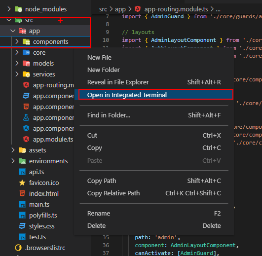
> Açılan terminale aşağıdaki komutu yapıştıralım.
> ```
> ng generate component animal-list --skip-tests
> ```
> Bu işlemden sonra `components` klasörü içinde `animal-list` klasörü oluştuğunu göreceksiniz. Bu klasörün içindeki `animal-list.component.ts` dosyasını açalım.
> ```ts
> constructor(private animalService: AnimalService) {}
> ```
> Constructor metodunu yukarıdaki gibi değiştirelim.
>
> Daha sonra aşağıdaki kodu `AnimalListComponent` sınıfının içine ekleyelim.
> ```ts
> animals: AnimalModel[];
> ```
> Son olarak da bütün hayvanları getirecek metodu `AnimalListComponent` içine yazalım.
> ```ts
> getAllAnimals() {
>    this.animalService.getAll().subscribe(
>    (response) => {
>        this.animals = response.data;
>    },
>    (responseError) => {},
>    () => {}
>    );
> }
> ```
> Bu işlem bize API aracılığıyla getirdiğimiz, veritabanında bulunan bütün `Animal` nesnelerini `animals` değişkeni içinde tutmamızı sağlayacaktır.
>
> Peki ya işlem başarısız olursa ?
> Bu durumlar için daha önceden yazılmış olan `ValidationService` sınıfını kullanacağız. Siz de bu sınıfı kendi projenize göre özelleştirebilirsiniz.
> 
> `ValidationService` sınıfını mevcut component içinde kullanabilmek için constructor metodunu aşağıdaki gibi düzenleyelim.
> ```ts 
> constructor(
>    private animalService: AnimalService,
>    private validationService: ValidationService
> ) {}
> ```
> Şimdi de `getAllAnimals` metodunu düzenleyelim.
> ```ts
> getAllAnimals() {
>    this.animalService.getAll().subscribe(
>    (response) => {
>        this.animals = response.data;
>    },
>    (responseError) => {
>        this.validationService.showErrors(responseError);
>    },
>    () => {
>       console.log('getAllAnimals() completed');
>    }
>    );
> }
> ```
> Bu işlem eğer istek işlenirken hata meydana gelirse hata mesajını `ngx-toastr` yardımıyla görmemizi sağlayacktır. Dilerseniz bu sınıfı düzenleyerek hataları istediğiniz gibi yönetebilirsiniz.
>
> Son olarak `getAllAnimals` metodunu `ngOnInit()` metodu içinde çağıralım.
>
> `animal-list.component.ts` dosyamızın son hali aşağıdaki gibi olmalıdır.
> ```ts
> import { Component, OnInit } from '@angular/core';
> import { ValidationService } from 'src/app/core/services/validation.service';
> import { AnimalModel } from 'src/app/models/animalModel';
> import { AnimalService } from 'src/app/services/animal.service';
>
> @Component({
>  selector: 'app-animal-list',
>  templateUrl: './animal-list.component.html',
>  styleUrls: ['./animal-list.component.css'],
> })
> export class AnimalListComponent implements OnInit {
>  animals: AnimalModel[];
>
>  constructor(
>    private animalService: AnimalService,
>    private validationService: ValidationService
>  ) {}
>
>  ngOnInit(): void {
>    this.getAllAnimals();
>  }
>
>  getAllAnimals() {
>    this.animalService.getAll().subscribe(
>      (response) => {
>        this.animals = response.data;
>      },
>      (responseError) => {
>        this.validationService.showErrors(responseError);
>      },
>      () => {
>        console.log('getAllAnimals() completed');
>      }
>    );
>  }
> }
> ```
> Şimdi ise `animals` değişkenini html sayfamızda görüntüleyelim.
> 
> `animal-list.component.html` dosyasını açıp içini silelim. Aşağıdaki kod bloğunu ekleyelim.
> ```html
> <div *ngIf="animals != null">
>   <h5 *ngFor="let animal of animals; let i = index">
>     {{ i }} | {{ animal.name }}
>   </h5>
> </div>
> ```
> Şimdi ise yaptığımız değişiklikleri görme vakti.
> İlk önce API yi çalıştıralım. Daha sonra da `Visual Studio Code` üzerinde terminal açıp (açık terminal varsa kullanabilirsiniz) 
> ```
> ng serve --open
> ```
> Komutunu terminale yapıştıralım.
>
> `src->app` klasörü içindeki `app.component.html` dosyasının içine aşağıdaki kodu ekleyelim.
> ```html
> <app-animal-list></app-animal-list>
> ``` 
> `app.component.html` dosyasının son hali aşağıdaki gibi olmalıdır.
> ```html
> <div *ngIf="translateKeys != null">
>   <router-outlet></router-outlet>
> </div>
> <app-animal-list></app-animal-list>
> ```
> Şimdi sayfayı yenileyip `F12` tuşuna basıp `Console` 'u açalım.
> 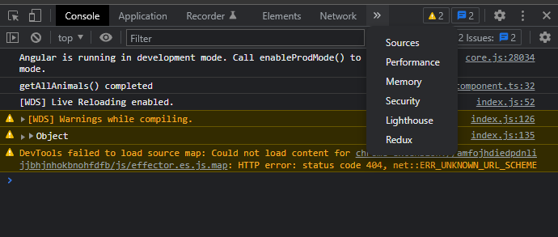
>
> Gördüğünüz gibi 'getAllAnimals() completed' mesajını aldık ekranda hiçbir şey göremememizin sebebi ise henüz veritabanında kayıtlı `Animal` nesnesinin bulunmaması.
>
> API üzerinden birkaç tane `Animal` nesnesi ekleyelim.
> Bunu yapmak için API'yi açalım (Daha Fazla Bilgi için [Swagger Dökümanını İnceleyebilirsiniz](https://swagger.io/tools/swagger-ui/))
> 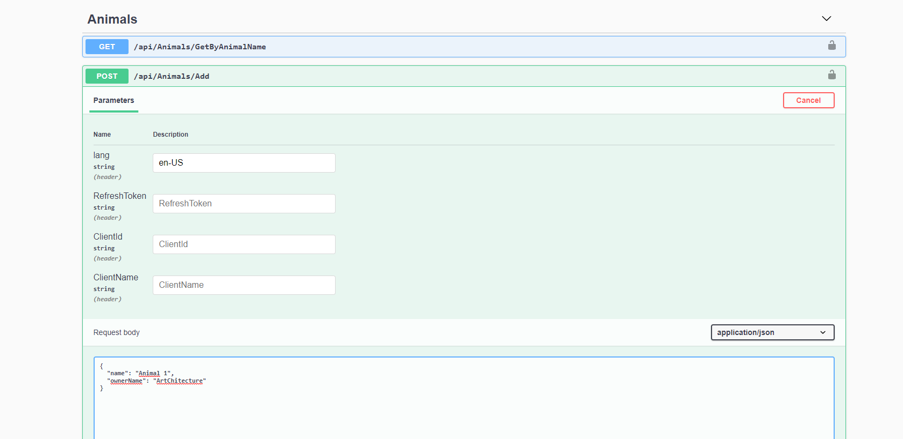
> `NOT` id değerini sildiğimize dikkat edin aksi takdirde hata alırsınız.
>
> Bu şekilde bir kaç tane `Animal` ekleyelim.
>
> `NOT` Eğer aynı `name` ve `ownerName` özelliğine sahip birden fazla `Animal` eklemeye çalışırsanız daha önceden yazmış olduğumuz `İş Kuralı` çalışacak ve size engel olacaktır.
>
> `Animal` nesnelerini ekledikten sonra biraz önce hazırlamış olduğumuz sayfayı açalım ve sayfayı yenileyelim.
> 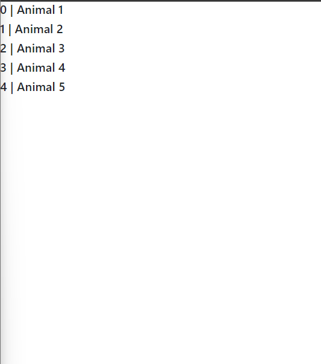
> Gördüğünüz gibi artık verileri de listeleyebiliyoruz.

### Componenti Sayfa Olarak Kullanma

---

## ArtChitecture.Flutter

### Entity Modelleme

### Service Oluşturma

### Component (Widget) Oluşturma

---

## İleri Seviye

### Aspects

#### Logging

#### Caching

#### Authorization

#### Transaction

#### Performance

#### Validation

#### Custom Aspect ve Interceptor

### Extensions ve Extension Yazma

### Helpers ve Helper Yazma

### IHttpContextAccessor

### IRequestUserService

### ITranslateContext ile Çoklu Dil Desteği

### Exceptions ve Errors

### ServiceTool ve Modules

### ITokenHelper ile Custom TokenHelper Oluşturma

### Startup.cs Konfigürasyonu

### SignalR Kullanarak Anlık Haberleşme

## Yayınlama
### ASP.Net Core
### Angular
### Flutter
